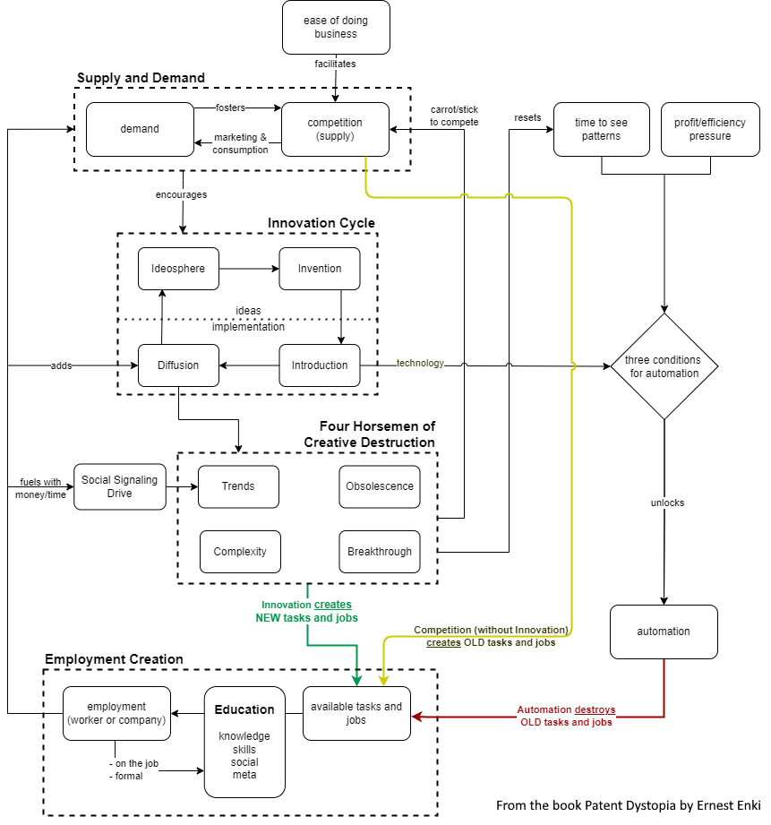
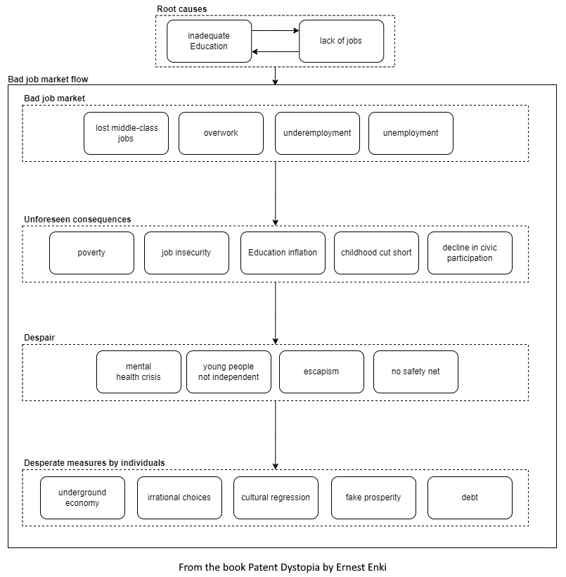
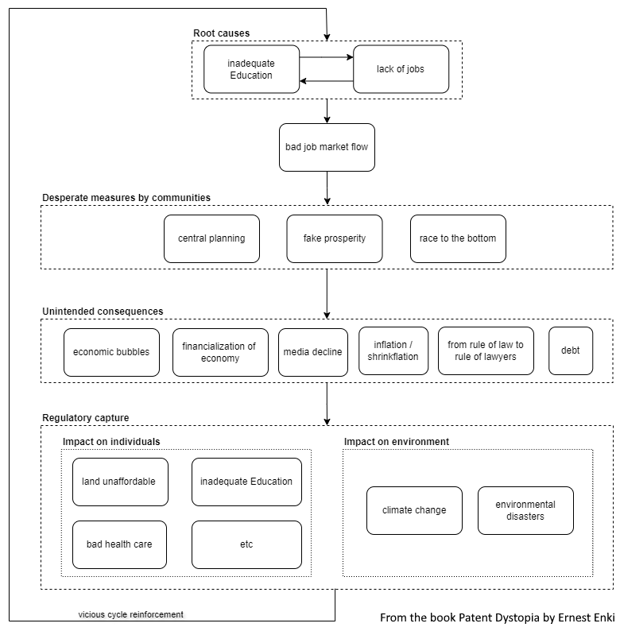
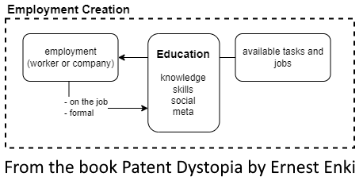
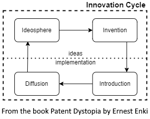
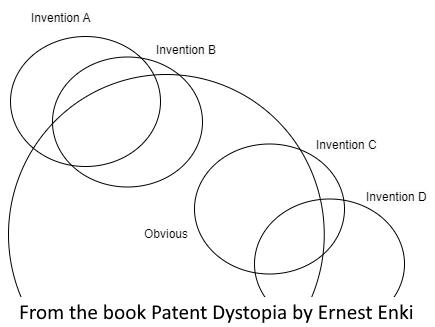
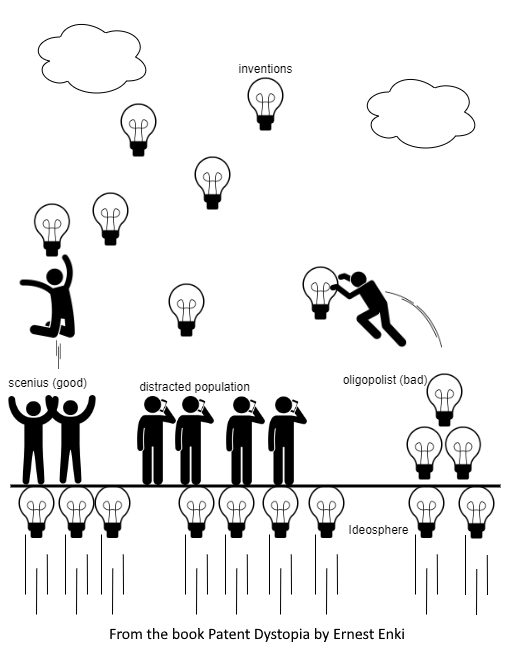
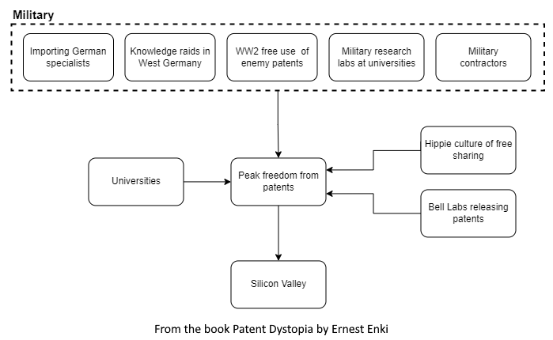
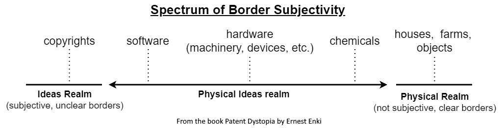
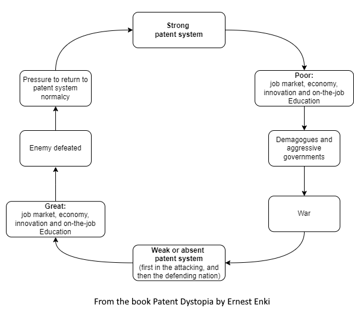

<base target="_blank" />

# About me
Ernest Enki is a pen name to safeguard my privacy and to allow the books and content to be judged solely on its content, independent of the author's background or unorthodox Education.

# Books

My first book, [Patent Dystopia: How the Patent System Strangled Innovation, Job Creation, and the Economy](https://www.amazon.com/dp/B0DKNT5YHT) was launched in Dec/2024

# Social Media

The Twitter (X) account [@ErnestEnki](https://x.com/ErnestEnki) is the only channel I use at the moment. 

Please follow me there to see news and comments related to the Patent Dystopia and other interesting subjects, or to contact me.

Any other social media presences are fake! Watch out !

# Images
All images, graphs, and data tables in my books are free to use in any context, including commercial use, as long as the attribution is included and visible on the image itself.

To make things easier, and in case  the images are not very clear in the book, here are some of the main images:

